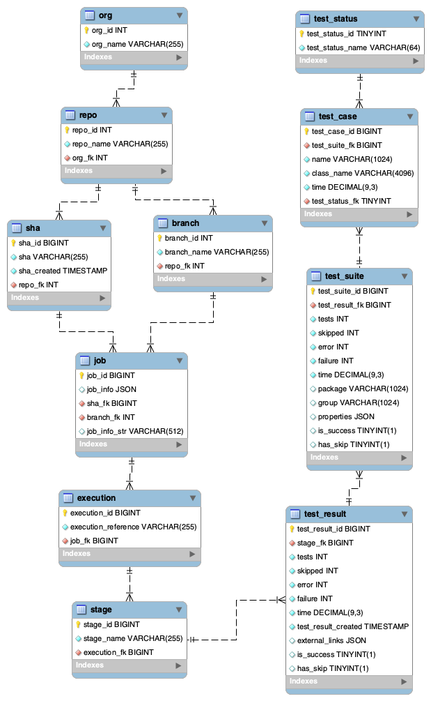

= Reportcard data model
:table-caption!:
:toc: macro
:hide-uri-scheme:
:sectlinks:

toc::[]

== Proposed Entity Relationship Diagram

== Build system entity relationships

Jenkins and Kubernetes/Spinnaker have very different data models

[cols="1,8"]
|===
|*Build System* |*Entity relationships*

|*Jenkins* |Org ← Repo ← Branch ← Build ← Test Report
|*Spinnaker* |Org ← Repo ← Application ← Pipeline ← Run ← Stages ← Test Report +
+++ &nbsp;&nbsp;&nbsp;&nbsp;&nbsp;&nbsp;&nbsp;&nbsp;&nbsp;&nbsp;&nbsp;&nbsp;&nbsp;&nbsp;&nbsp;&nbsp;&nbsp;&nbsp;&nbsp;&nbsp;&nbsp;&nbsp;&nbsp&nbsp;&nbsp;&nbsp; +++ ↖ Branch †↙
|===

† _Branch is defined in webhook triggers for pipelines. DIfferent pipelines may be triggered by distinct branches._

==== Spinnaker/Kubernetes entities
A repository in a Github organization, e.g. MyOrg/MyRepo may have multiple applications.

Each pipeline may consist of multiple stages, e.g. `(integration test → deploy → api test)`

Multiple stages in the same pipeline may produce distinct junit/surefire xml reports.

In addition, unit test report data may exist from a build stage for a Docker image

Typical Spinnaker Test Data Lifecycle

. Git: commit (with sha) →
. Jenins: build → unit test → publish docker image →
. Spinnaker/Kubernetes: pipeline run trigger → integration test → deploy → api test

== Proposed Data Model

=== Proposed Entity Cardinality
|===
|Org ← Repo ← Branch ← Job ← Run ← Stage ← Test Suites +
+++ &nbsp;&nbsp;&nbsp;&nbsp;&nbsp;&nbsp;&nbsp;&nbsp;&nbsp;&nbsp;&nbsp;&nbsp;&nbsp;&nbsp;&nbsp;&nbsp;&nbsp;&nbsp;&nbsp;&nbsp;&nbsp;&nbsp;&nbsp&nbsp;&nbsp;&nbsp; +++ ↖ Sha ↙
|===

=== Proposed Entity Mappings
|===
|*Proposed Model* |*Jenkins* |*Kubernetes*

|Org |Org |Org*
|Repo |Repo |Repo*
|Branch |Branch |Branch*
|Sha |$GIT_COMMIT  | Sha*
|Job |jobInfo: { "host" : …} |jobInfo : { "host" : …, "application": …., "pipeline": ….}
|Run |Build |Run
|Stage |parameter |String (e.g. unit)
|===

_* Not native to Kubernetes model. Environment variable would need to be set as part of pipeline definition or defined when building docker image_

=== Job entity simplifies metadata model

A job entity solves several problems

. Supporting multiple instances of Jenkins and/or Kubernetes
. differentiating multiple runs for the same sha from different Jenkins or Kubernetes instances
. Supporting application and pipeline as optional parameters to support indexable querying without needing any join tables

=== Entity Fields

|===
|*Entity* |*Fields* |*Candidate Keys*

|Org
|*org_id* : auto_number +
 *org_name* : string
|org_id +
org_name

|Repo
|*repo_id* : auto_number +
 *repo_name* : string +
 *org_fk:* number
| repo_id +
org_fk and repo_name

|Branch
|*branch_id* : auto_number +
*branch_name* : string +
*repo_fk* : number
| branch_id +
repo_fk and branch_name

| Sha
| *sha_id* : auto_number +
  *sha* : string +
  *repo_fk* *: number +
| sha_id +
  repo_fk and sha

| Job
| *job_id* : auto_number +
  *job_info:* json +
  *branch_fk* : number +
  *sha_fk* : number +
  *job_info_str*: string (generated from job_info)
| job_id +
branch_fk, sha_fk, and job_info_str

| Run (Build) | *run_id* : auto_number
*run_external_id* : string
*context_fk* : number | run_id,
context_fk and run_number

| Stage | *stage_id* : auto_number +
  *stage_name* : string +
  *run_fk* : number +
| stage_id +
  run_fk and stage_name

| Test Result *‡* (Test Suites)
| *test_result_id* : auto_number +
  *test_result_name* : string +
  *tests* : number (aggregate) +
  *pass* : number (aggregate) +
  *fail* : number (aggregate) +
  *error* : number (aggregate) +
  *skip* : number (aggregate) +
  *created* : timestamp +
  *is_success* : function/boolean +
  *has_skip* : function/boolean +
  *stage_fk:* number
| test_result_id +
  stage_fk and test_result_name
| Test Suite *‡* | *test_suite_id* : auto_number *package* : string *group* : string
  *tests* : number (aggregate) +
  *pass* : number (aggregate) +
  *fail* : number (aggregate) +
  *error* : number (aggregate) +
  *skip* : number (aggregate) +
  *time* : duration +
  *is_success* : function/boolean +
  *has_skip* : function/boolean +
  *test_result_fk:* number +
| test_suite_id +
test_result_fk and group

| Test *‡*
| *test_case_id* : auto_number +
  *name* : string
  *class_name* : string +
  *time* : duration +
  *status_fk* : number +
  *test_suite_fk* : number
| test_case_id +
test_suite_fk, class_name, and name

| Test Status
| *test_status_id:* auto_number +
  *test_status_name:* string
| test_status_id + test_status_name
|===

‡ _ _See JUnit and Surefire XSD to show which fields are inherent to data model_