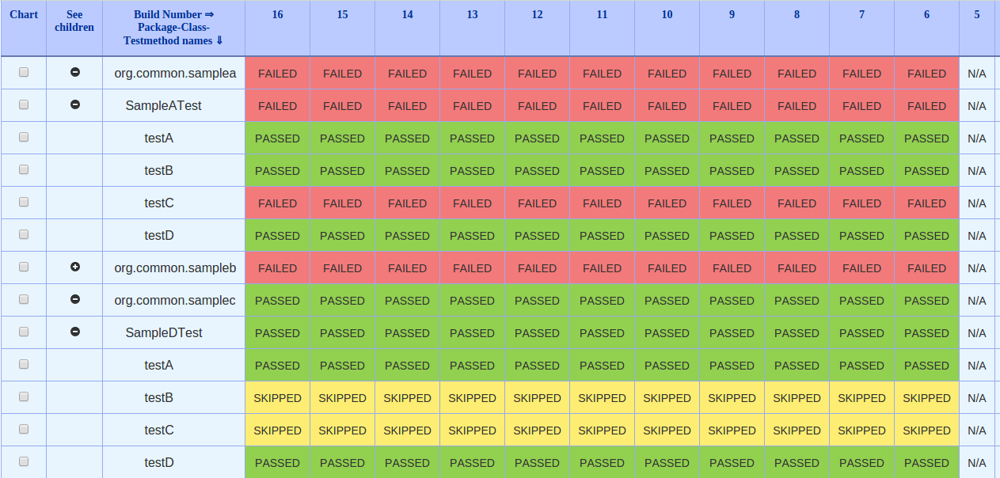

= Reportcard requirements
:table-caption!:
:toc: macro
:hide-uri-scheme:
:sectlinks:

toc::[]

Author: Eric Driggs

== Value Proposition

=== Problems

* want to identify all tests which have been flaky over any time period

* test run in spinnaker/kubernetes are handicapped since no built-in solution for:
** html reports
** test trend analysis

* want dashboards to identify failures/issues for an entire org, not just a single repo or branch

=== Solutions
* storing test results in a database make it possible to generate time-saving
** metrics
** reports
** dashboards
** monitors and alerts

* html reports can be stored in s3
** correlated to text runs in database

* can produce dashboards for org and/or repo showing if latest runs have failures based on
** specified branches
** custom metadata
** correlate results by SHA for multiple build systems

=== Metrics/tools for improving test reliability, visibility, and performance:

*Org*

* Dashboard to with latest run status for master/develop branches for each repo
* see all repos with recent failures in single page

*Repo*

* tests with highest failure %
* longest running tests with durations
* % of runs with any test failures
* % of tests which pass

*BranchGraph*

* Dashboard similar on <<Test Results Analyzer Plugin>>

== Test Results Analyzer Plugin

For the most recent Jenkins builds on any branch, the https://plugins.jenkins.io/test-results-analyzer/[Test Results Analyzer Plugin] does an admirable job of answering triage questions about

* whether failures are deterministic
* when tests ran
* which branch(es) the tests are failing.

It provides an automatic out of the box analysis report as long as

1. The plugin is installed on the Jenkins master

2. The build publishes a junit xml report or surefire xml reports as part of its pipeline

==== Aggregation

Since the plugin executes in the context of a Jenkins build, it natively handles org/repo/branch aggregation, such that:

* Users can browse to the particular branch (e.g. master, develop, feature) they are interested in analyzing for a particular repo.

* The test result report only includes data from builds on the current branch selected

Using the report, one can quickly distinguish between

* non-deterministic (flaky) tests, with intermittent failures and passes (green and red line)
* deterministic failing tests (solid red horizontal line).
* Requires investigation to determine if continuously failing tests are valid or invalid

==== Limitations

While the plugin provides good return on minimal time investment, it does have some notable limitations:

===== Inherent Limitations

* History limit of 11 runs. Data on older runs is lost, so it cannot provide long-term trend metrics.
* No custom metrics / you are limited to the default report
* Not a standalone service, so only works for Jenkins jobs. (Unable to support Spinnaker/Kubernetes jobs)

===== Usability Annoyances

* Can't filter out tests without failures or sort tests by # of failures, so may require repeated scrolling to find which tests are failing.
* Automatically "rolls up" all tests for the same suite, requiring user to click each suite to see failing test cases

== Requirements

---
=== API

* Support publishing test result data in JUnit and Surefire XML formats
* Should be able to POST from both Jenkins and Spinnaker
* Should have payload for metadata to support aggregation and meaningful filtering (e.g. branch) for any build system
** should support flexible metadata for job context allowing arbitrary filtering
* Should support publishing html test reports
* Have Api for getting test trend results
* query parameter for # of runs to aggregate

=== Client

* make it easy to publish data from Jenkins or Spinnaker
* have minimal runtime dependencies (java ok)

=== Report

* Similar to test results analzyer plugin report
* Show trend results for each test (by name)
* Distinguish between tests with the same name in different test suites
* Support filtering data so only show trend for requested branch
* Initial version JSON only, later also in HTML
* HTML is easier for tester usability
* JSON has advantages for dashboards and metrics
* Support option to filter out tests which have not seen failure
* Show overall test metrics for requested # of builds/runs
* % of tests passed
* % of builds where all tests passed

=== No manual configuration to publish for additional repos/branches

* Support POST data for any combination of org/repo/branch/sha without any manual configuration
* Must support filtering based on parameters so only relevant data can be aggregated
** (e.g. only show data for requested branch)

== Meaningful Test Trend Analysis

Test trend analysis would be meaningful across builds for a particular context/stage, e.g.

|===
|Org |MyOrg
|Repo |MyRepo 
|Branch |develop 
|Sha |* 
|Job | { "host": "https://www.foo.com" }
|Run |* 
|stage |api-test 
|===

=== Entity Relation Diagram

== Survey of Existing solutions

=== Reporting Portal

* Very slow, both navigation and at report level
* Limited aggregation. (Jobs not grouped by branch.)
* Dashboards and reports must be configured manually
* Not branch-aware (requires manual actions per branch)

=== ZebRunner

* No native aggregation in data model
* Only table with org/repo data is SCM which is not first-normal form
* org data duplicated
* No branch field
* only has foreign key to users table (uncorrelated to jobs)
* Unable to natively support browsing from org -&gt; repo -&gt; branch
* Would require significant schema modification to support aggregation
* Would require manual or scripted action to simulate aggregation

== Additional Features for later versions

== S3

* publish html reports and logs to s3
* database model should be expanded to support html and logs (additional file types?)
* should account for s3 object expiration through lifecycle using prefixes

== User Interface

* initial version will be json only endpoints
* future versions should have a UI, especially for test trends, similar to jenkins test result analyzer

== Security

* security milestone 1 can use basic auth
* security milestone 2 should issue expirable tokens, e.g. JWT with 2 hour expiration
* security milestone 3 should have multiple permission levels/roles
* view
* post
* admin
